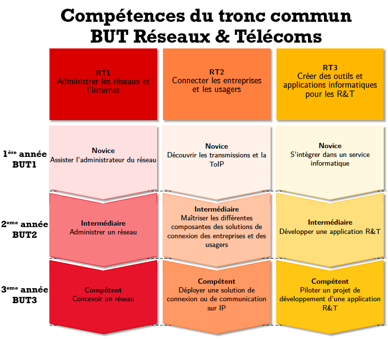

.. CyberSécurité BUT R&T documentation master file, created by
   sphinx-quickstart on Wed Mar 10 11:41:48 2021.
   You can adapt this file completely to your liking, but it should at least
   contain the root `toctree` directive.

.. _index:

.. meta::
   :description lang=fr: BUT R&T, Bachelor Universitaire Technologique Réseaux & Télécoms

BUT Réseaux & Télécoms
======================

A partir de la rentrée de septembre 2021, le nouveau diplôme du `B.U.T. (Bachelor Universitaire Technologique) <https://but.iut.fr/>`_ s'articule sur 3 années de formation.

.. admonition:: La spécialité Réseaux & Télécoms est composée d'un tronc commum de 3 compétences :

   - **Administrer les réseaux et l'Internet**
   - **Connecter les entreprises et les usagers**
   - **Créer des outils et applications informatiques pour les R&T**

Ces compétences sont dispensées sur les 3 ans de formation avec une acquisition progressive des **Apprentissages Critiques**.

La spécialité Réseaux & Télécoms propose 5 parcours dispensés suivant les établissements IUT:
   - :doc:`CyberSécurité (Cyber) <parcours_cyber>`
   - Développement système et cloud (DevCloud)
   - Internet des objets et mobilité (IOM)
   - Pilotage des projets de réseaux (PilPro)
   - Réseaux opérateurs et multimédia (ROM)

Le référentiel global de compétences est disponible :download:`ici <referentiel-competences-RT.pdf>`

.. toctree::
   :maxdepth: 3
   :hidden:
   :caption: Parcours CyberSécurité

   parcours_cyber.rst
   parcourscyber/metiers.rst
   parcourscyber/competences.rst

.. Ressources
.. ----------

.. toctree::
   :maxdepth: 3
   :caption: Ressources

   parcourscyber/ressources/hygiene.rst
   parcourscyber/ressources/pentest.rst

Situations d'Apprentissage et d'Evaluation (SAE)
------------------------------------------------

.. toctree::
   :maxdepth: 3
   :caption: Situations d'Apprentissage et d'Evaluation (SAE)

