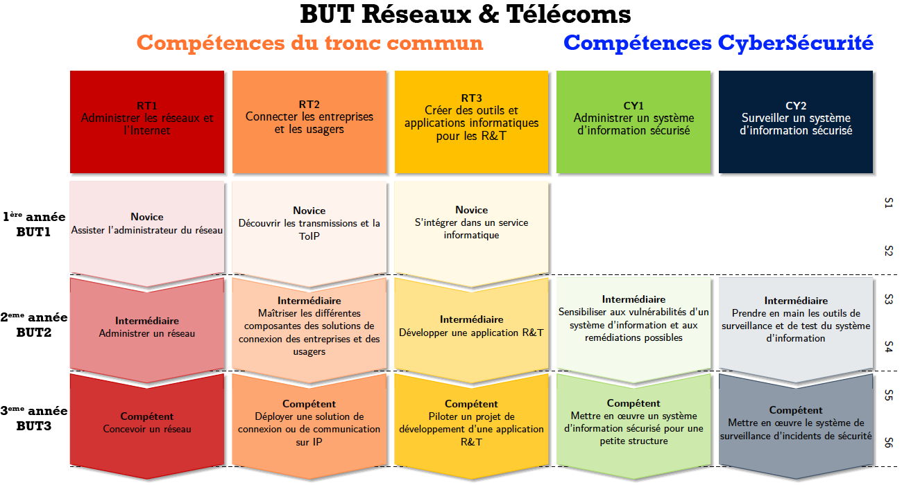

.. _compo_essentielles:

.. meta::
   :description lang=fr: BUT R&T, Les compétences de la CyberSécurité à BAC+3

Les compétences
===============

A partir de la 2ème année du BUT les compétences en CyberSécurité (CY1 et CY2) sont acquisent en même temps que les compétences du tronc commun (RT1, RT2, RT3).

**Sécuriser (CY1)** |:arrow_right:| **Administrer un système d'information sécurisé**
-------------------

Définition
~~~~~~~~~~
Un Système d’Information (SI) peut être défini comme l’ensemble des ressources de l’entreprise qui permettent la gestion de l’information. Le SI est généralement associé aux technologies des infrastructures systèmes, réseaux et informatiques, aux processus qui les accompagnent, et aux personnes qui les supportent. 
La conception d’un SI commence inévitablement par une analyse de l’existant et des risques associés. Cette étape inclut une analyse des besoins de l’entreprise et permet d’identifier les biens essentiels à protéger au mieux et de définir ainsi une politique de sécurité du SI (PSSI). Une architecture du SI pourra ainsi être définie et déployée, répondant aux besoins de sécurité précédemment établis. Le facteur humain est le principal facteur de risque ; la responsabilisation et la formation du personnel sont par conséquent essentiels. En outre, les attaques sont de plus en plus courantes et sophistiquées et il est donc important pour la sécurité de s’appuyer sur les méthodes et les normes existantes, de respecter le cadre juridique et de mettre à jour régulièrement sa politique.

Composantes essensielles
~~~~~~~~~~~~~~~~~~~~~~~~
	* en visant un juste compromis entre exigences de sécurité et contraintes d’utilisation
	* en respectant les normes et le cadre juridique
	* en intégrant les dernières technologies
	* en travaillant en équipe
	* en sensibilisant efficacement des utilisateurs

Situations professionnelles
~~~~~~~~~~~~~~~~~~~~~~~~~~~
	* Analyse de l’existant et étude des besoins de sécurité d’une petite structure
	* Évolution et mise en conformité du système d'information d’une entreprise

Niveaux de développement
~~~~~~~~~~~~~~~~~~~~~~~~
	1. **Intermédiaire**: Sensibiliser aux vulnérabilités d'un système d'information et aux remédiations possibles
	:doc:`Hygiène <ressources/hygiene>`
	2. **Compétent**: Mettre en œuvre un système d'information sécurisé pour une petite structure

Apprentissages Critiques
~~~~~~~~~~~~~~~~~~~~~~~~
	+--------+--------------------------------------------------------------------------------------------+
	|  Code  | Intitulé Apprentissage Critique                                                            |
	+========+============================================================================================+
	| AC1121 | Utiliser les bonnes pratiques et les recommandations de cybersécurité
	:doc:`Hygiène <ressources/hygiene>`                      |
	+--------+--------------------------------------------------------------------------------------------+
	| AC1122 | Mettre en oeuvre les outils fondamentaux de sécurisation d’une infrastructure du réseau    |
	+--------+--------------------------------------------------------------------------------------------+
	| AC1123 | Sécuriser les systèmes d’exploitation                                                      |
	+--------+--------------------------------------------------------------------------------------------+
	| AC1124 | Choisir les outils cryptographiques adaptés au besoin fonctionnel du système d’information |
	+--------+--------------------------------------------------------------------------------------------+
	| AC1125 | Connaître les différents types d’attaque                                                   |
	+--------+--------------------------------------------------------------------------------------------+
	| AC1126 | Comprendre des documents techniques en anglais                                             |
	+--------+--------------------------------------------------------------------------------------------+

**Surveiller (CY2)** |:arrow_right:| **Surveiller un système d'information sécurisé**
--------------------

Définition
~~~~~~~~~~
Afin de rester fiable et opérationnel, un système d’information doit être sous surveillance permanente et en perpétuelle évolution et ce, dès sa mise en production. Il doit donc intégrer tous les outils nécessaires à son exploitation, c’est-à-dire permettant d’en assurer sa configuration optimale, de l’administrer, de le surveiller, de le mettre à jour, d’en assurer la continuité de service (notamment le sauvegarder et le restaurer) et d’en gérer les changements.
De même, en cas d’incident constaté (ce qui doit toujours rester une éventualité envisagée), toutes les procédures à suivre doivent être prévues à l’avance et mises en \oe{}uvre afin de minimiser les impacts et conséquences de l’incident, notamment au travers de plans de reprise ou de continuité d’activité.

Composantes essensielles
~~~~~~~~~~~~~~~~~~~~~~~~
	* en assurant une veille permanente des attaques et défenses
	* en réalisant les mises à jour critiques
	* en automatisant des tâches
	* en s’intégrant dans une équipe
	* en surveillant le comportement du réseau
	* en veillant au respect des contrats et à la conformité des obligations du système d'information

Situations professionnelles
~~~~~~~~~~~~~~~~~~~~~~~~~~~
	* Surveillance et analyse du système d’information
	* Audit de sécurité
	* Gestion d'un incident de sécurité

Niveaux de développement
~~~~~~~~~~~~~~~~~~~~~~~~
	1. **Intermédiaire**: Prendre en main les outils de surveillance et de test du système d'information
	2. **Compétent**: Mettre en œuvre le système de surveillance d'incidents de sécurité

